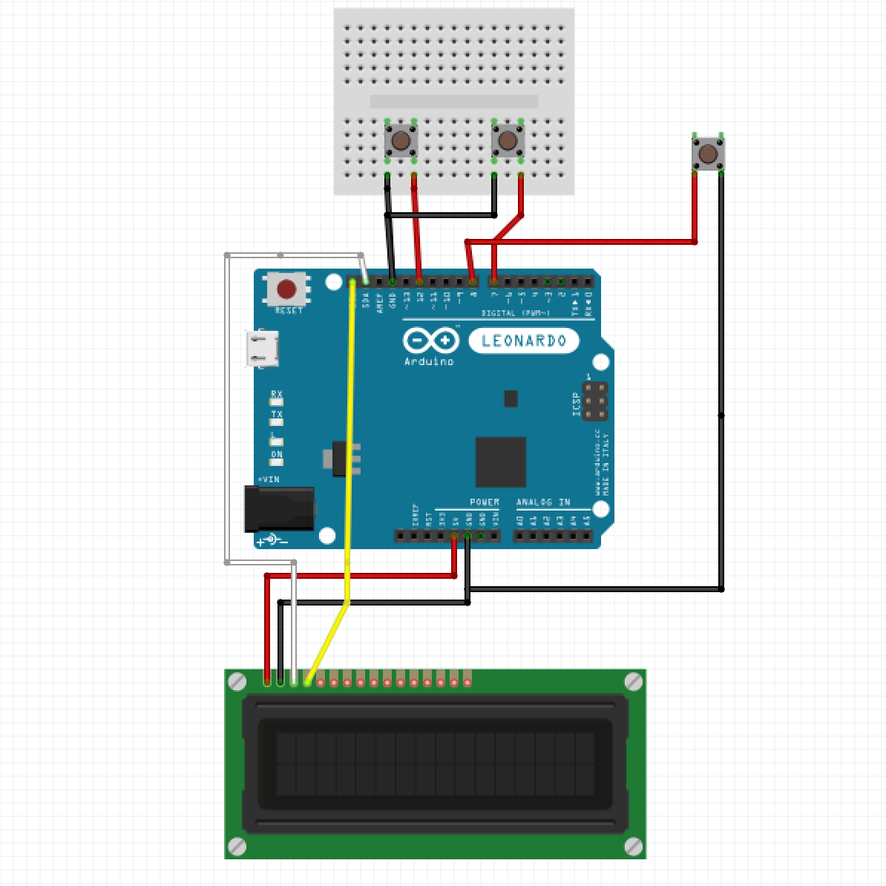
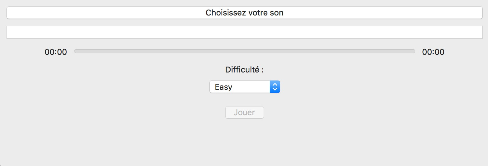

# GuitarDuino
GuitarHero for Arduino Leonardo

## Requirements:
- Arduino Leonardo
- Mac os x
- 3 push buttons
- 1 LCD screen

## Circuit Diagram

## Library
- For Mac os x application :
- AudioKit ([link](https://github.com/AudioKit/AudioKit))
- ORSSerial ([link](https://github.com/armadsen/ORSSerialPort))
- For Arduino application :
- rgb_lcd ([link](https://github.com/Seeed-Studio/Grove_LCD_RGB_Backlight))

## Installation
- In your Mac os x :
- Install Arduino ([download page](https://www.arduino.cc/download_handler.php?f=/arduino-1.8.5-macosx.zip))
- Install Xcode
- Install Cocoapods
- In your terminal :
`$ cd code_swift/`
`$ pod init`

## How to launch the game
- Plug the arduino to your Mac os x
- Send Arduino code in your Arduino
- In your terminal :
`$ open ./code_swift/guitarHeroArduino.xcworkspace`
- Run project

- Start a game

## Rules
- Open the Mac os x program and select the audio file, the difficulty
- Be prepared with the push buttons and press play
- When one or two triangles hit the line on the LCD you have to press the corresponding push buttons and validate with the third push button (Like Guitar Hero)
- If you miss too much triangles you will loose
- If you complete the whole music you win

# *Have a good game*
